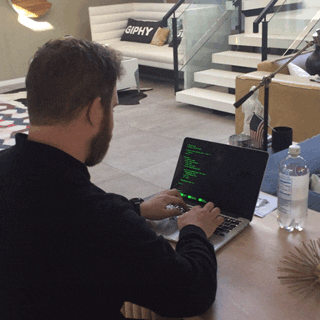
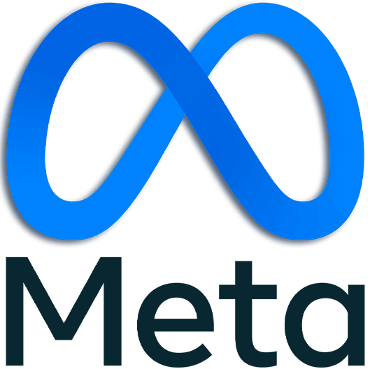

<strong>👋 Hey, I'm Gabi!</strong>

  <ul>
  <li>📚 I’m currently a Full Stack Development student</li>
  <li>💻 I work with HTML, CSS and JavaScript mainly</li>
  <li>🎨 I'm a Graphic Designer</li>
  <li>📱 I develop Augmented Reality <a href="https://www.instagram.com/airesgab/">Instagram filters </a></li>
  <li>💬 I like to talk about Zelda and Avenged Sevenfold</li>
  <li>⚡ Fun fact: 私は日本人とブラジルジンハーフです 🇯🇵🇧🇷</li>
  <li>📫 How to reach me: gabes_t@hotmail.com</li>
  </ul>

<h2> 🚀 Tools I have used and learned</h2>

          

